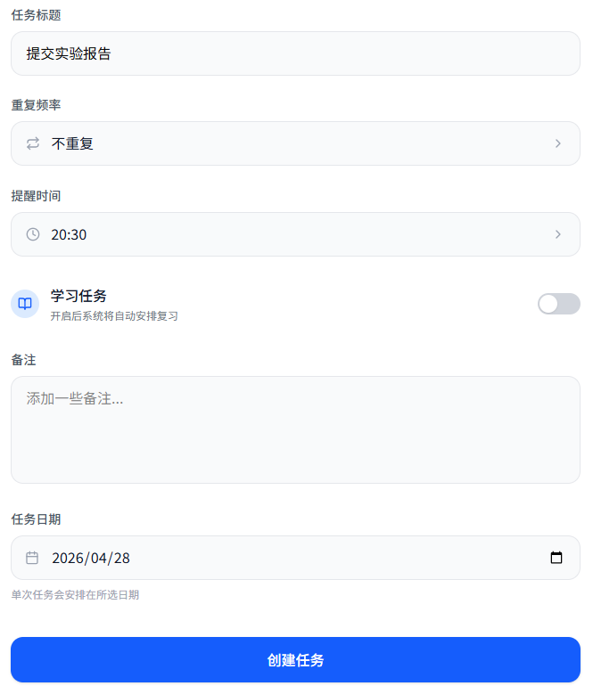
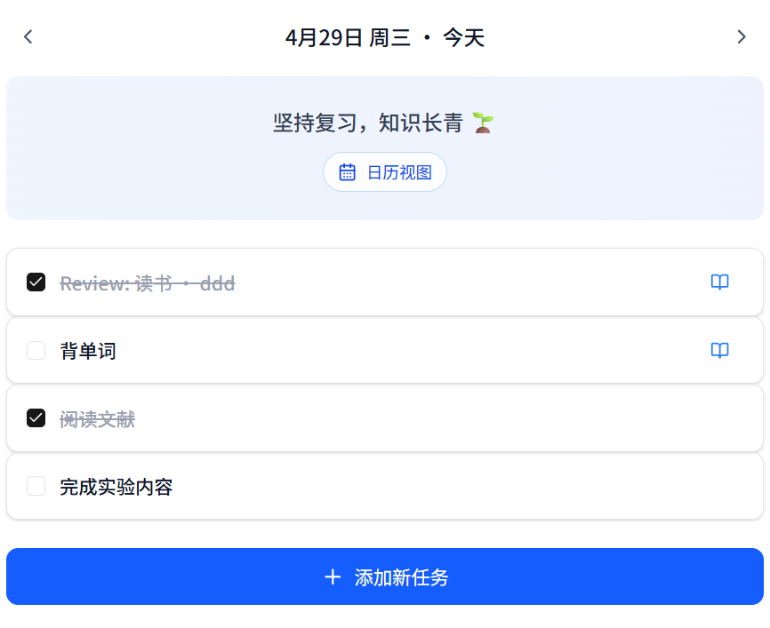
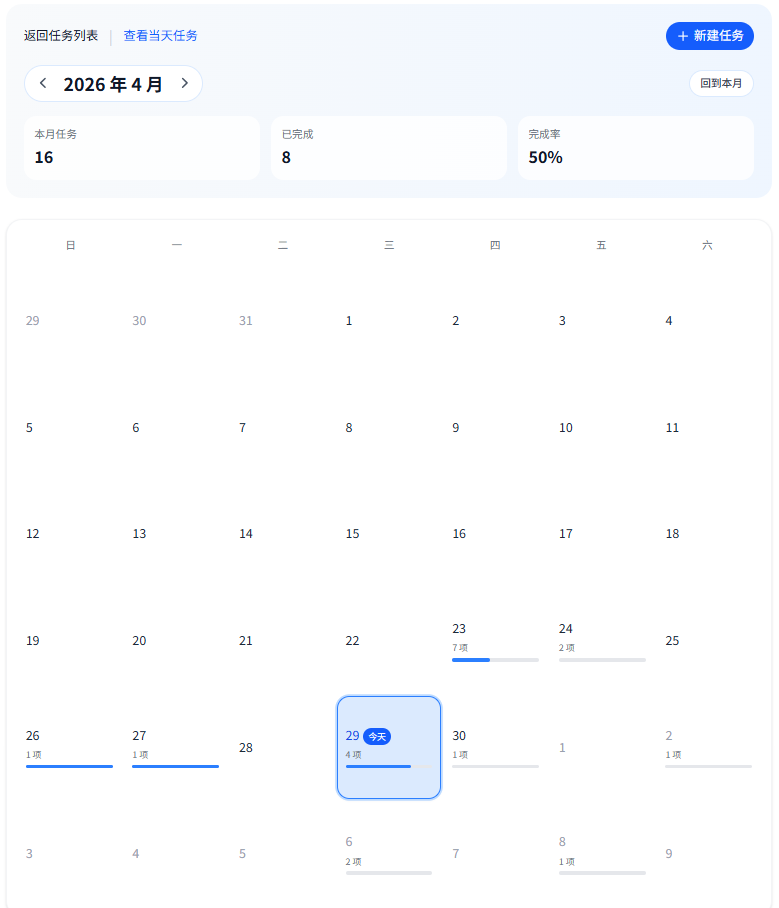
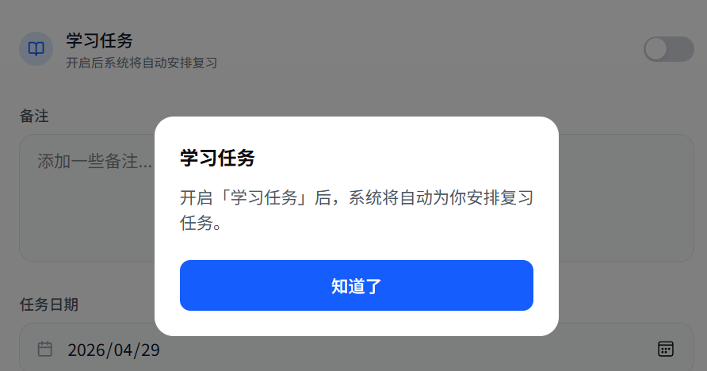
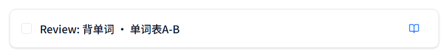
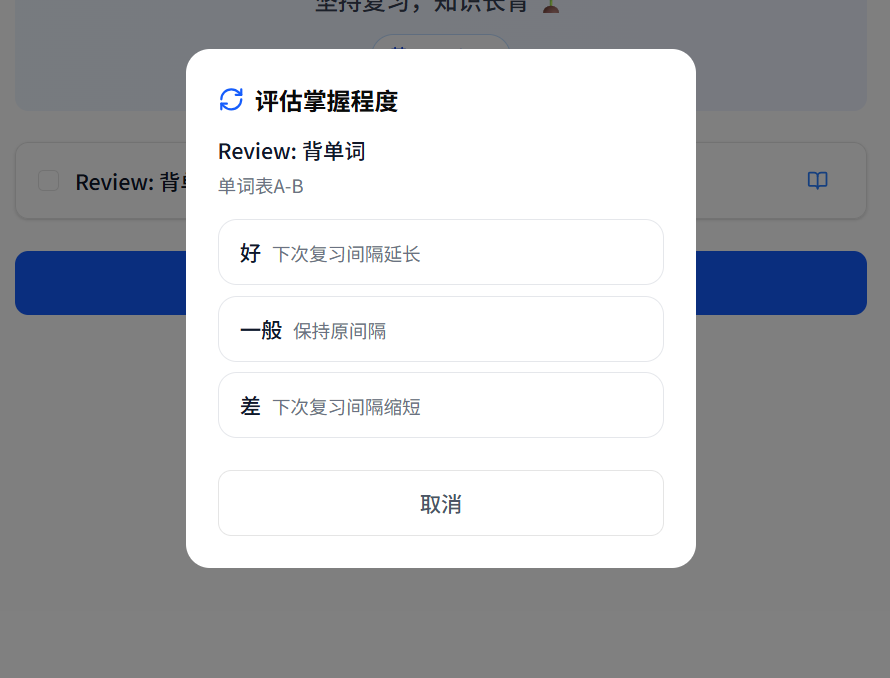

# memo-list
一个具有自动安排复习功能的to-do list应用

## 这是个什么东西？

这是一款**与众不同**的任务日程管理工具。你完全可以把它当做一个常见的to-do list软件去使用，但是，在这么做之前，请先了解一下我们的全部功能。

### 基础任务管理

我们支持任务管理相关的基本操作。创建单次任务，或者预定重复任务，满足你的基本需求。



任务管理就要一目了然！所有当日日程都在主页面按照列表形式呈现。



当然还有必不可少的整月任务预览：



### 学习类任务

我们都知道，如果学习后不复习，等待我们的将是彻底的遗忘。

为了解决兼顾用户需要计划安排学习事宜的需求，我们在这款to-do应用中创新引入了**学习类任务**。对于学习任务，系统会参考艾宾浩斯遗忘曲线，在合适的时间节点**自动安排复习任务**，助力科学复习，减少无意义的时间浪费，用更少的时间取得更大的学习成果。



比如在完成了背单词的任务后，系统会要求你填写学习的具体内容。后续会**自动生成**对应的复习任务。



完成复习任务会要求你自我评估掌握程度，并根据这个信息调整后续复习间隔。



有了这么好的工具辅助，我们可以更好地规划自己每一天的生活，并且**不用再为知识的遗忘而担心了**！

自动化的复习任务安排不但节省了规划相关任务的时间，而且可以实现更加高效的学习。**想知道如何使用？请见下一节**。

## 如何开始使用？

### 互联网访问

请访问这个网址：[memo-list · 你的智能化学习任务管理助手](https://memo-list.top)，开始你的学习任务管理之旅！

> 请注意！目前该网站属于尝试部署状态，不能保证该链接的长期有效。后续可能会更换服务器。

### 安装android客户端

在release中找到最新版本的apk文件，在符合要求的移动设备上安装。

> 请注意！该客户端指向的是上一种方法的服务器，存在服务器更换的可能性。

### 本地部署

将本项目的代码下载或clone到本地，确保本地`npm`已经安装，然后进行以下操作：

1. 构建并启动后端服务（默认在`http://localhost:4000`）

   ```sh
   cd memo-backend
   npm install
   npm run build
   npm run start
   ```

2. 构建并启动前端服务（默认在`http://localhost:3000`）

   ```sh
   cd memo-frontend
   npm install
   npm run build
   npm run start
   ```

3. 在浏览器访问`http://localhost:3000`即可体验本地服务。

## Project Structure

- `memo-frontend`: Next.js frontend application
- `memo-backend`: standalone backend API service for task management + memory-curve scheduling

## Run Locally

1. Build and start backend

```bash
cd memo-backend
npm install
npm run build
npm run start
```

Backend default URL: `http://localhost:4000`

2. Build and start frontend (new terminal)

```bash
cd memo-frontend
npm install
npm run build
npm run start
```

Frontend default URL: `http://localhost:3000`

3. Access `http://localhost:3000` from your favorite browser.

## Run Locally in Dev Mode

1. Start backend

```bash
cd memo-backend
npm install
npm run dev
```

Backend default URL: `http://localhost:4000`

2. Start frontend (new terminal)

```bash
cd memo-frontend
npm install
NEXT_PUBLIC_API_BASE_URL=http://localhost:4000 npm run dev
```

Frontend default URL: `http://localhost:3000`

## 如何进行贡献？

1. 请将仓库`fork`一份到自己的名下。
2. 将自己的仓库`clone`一份到本地。
3. 在本地进行修改。
4. `git push`修改后的本地仓库到自己的云端仓库。
5. 在原仓库提交`PR`合并修改。
